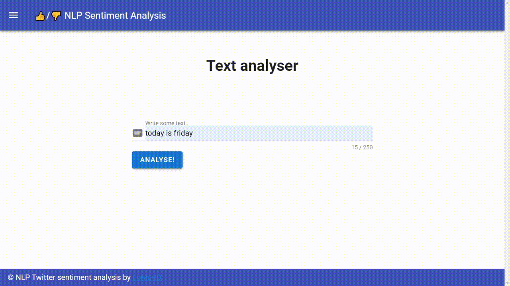
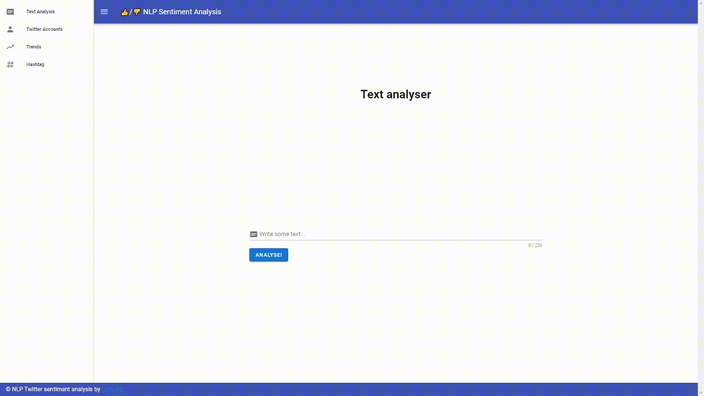
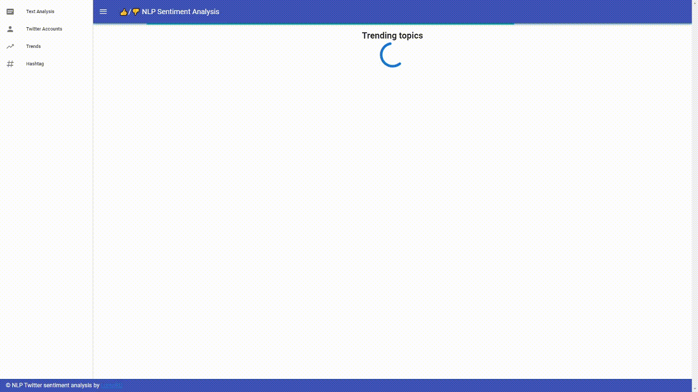
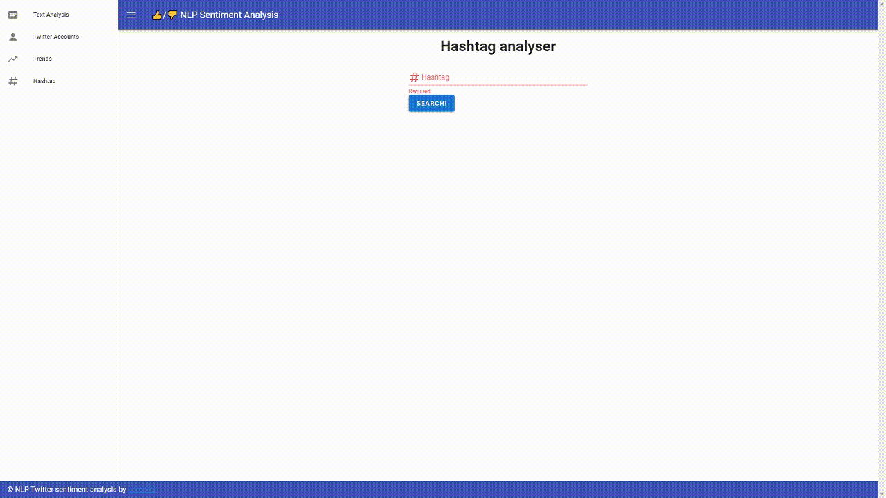

# Twitter Sentiment Analysis APP

This is a personal project for getting started with NLP. 



## Index
1. [Functionalities](#Functionalities)
2. [About the project](#About-the-project)
3. [Frontend Project setup](#Frontend-Project-setup)
4. [Backend Project setup](#Backend-Project-setup)


## Functionalities
* Text analysis:

    This functionality allow you to analyse a simple text (like the body of a tweet), when submit the analyser will return a value that represent what your text transmit. It can be possitive, negative or neutral.

    


* Trends analysis:

    Here you can see some tweets from the top trends analysed and colored depending their sentiment.

    

* Account analysis:

    Introduce a Twitter ID (@account) and the app will analyse the lastest tweets of the account.

    

* Hashtag analysis:

    Introduce a topic (#topic) and the app will analyse the lastest tweets of the toppic.    

    


## About the project

After getting my [Tensorflow Developer Certification](https://developers.google.com/certification/directory/tensorflow) I wanted to start doing my own projects and decided to create this app after watching this dataset on [Kaggle](https://www.kaggle.com/kazanova/sentiment140) to getting in touch with NLP.

So I trainned a [NLP model](https://www.kaggle.comtwitter-sentiment-analysis) export it and create a Flask API to serve front end requests.

You can download the .h5 model [here](https://drive.google.com/file/d/1DIOlVlO7NG-jgxm9nwrtlr1mOIqXD_R9/view?usp=sharing).

## Frontend Project setup
```
npm install
```

### Compiles and hot-reloads for development
```
npm run serve
```

### Compiles and minifies for production
```
npm run build
```

## Backend Project setup
```
pip install -r requirements.txt
```

### Run Flask API
```
python application.py
```
